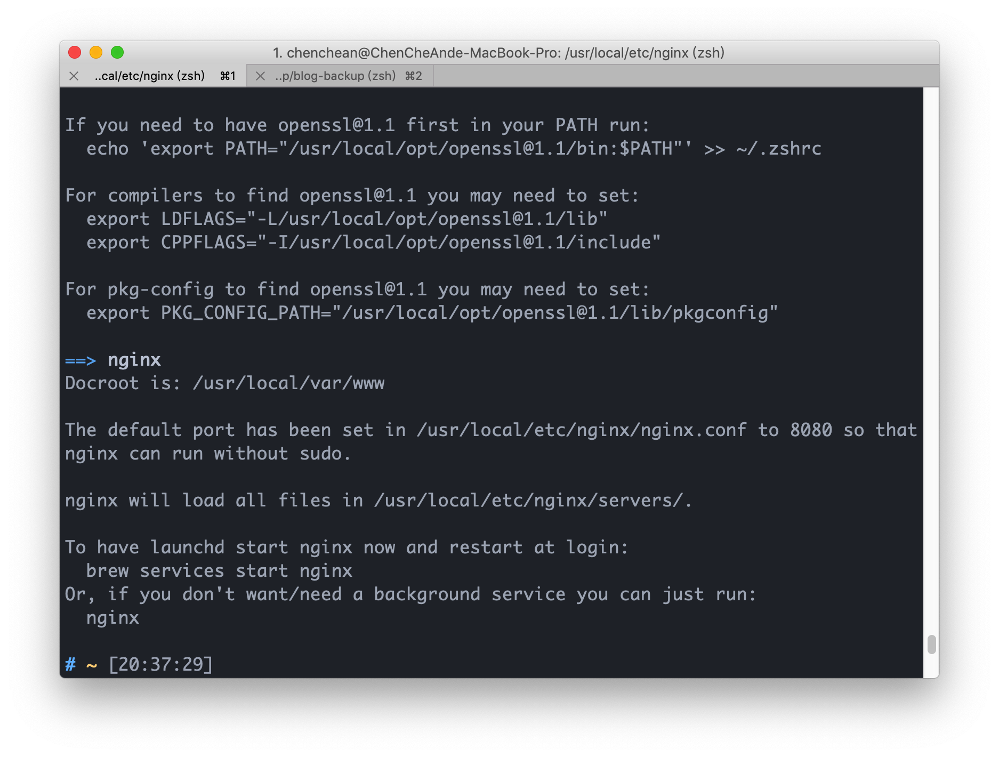

# nginx 在 mac 安裝以及簡易文件說明

在 mac 上安裝 nginx 可以使用 brew 進行安裝

```shell
brew install nginx
```

安裝完可以下

```
nginx
```

來啟動服務


從安裝完的畫面我們可以知道
nginx.conf 這個重要的設定文件路徑為/usr/local/etc/nginx/nginx.conf

---

## nginx.conf

我們先以原始的內容做說明
下方的#及為註解的部分

```text
#基本上就是啟動這個服務的用戶是誰，通常可以不進行設定
#user  nobody;

#通常在直接作為伺服器的server上面，會將worker_processes設為server CPU的core數量
#也可以直接使用auto 讓Nginx進行偵測
worker_processes  1;

#下方為Nginx的錯誤日誌
#前方的error_log為關鍵字，不可更改
#logs/error.log為存放錯誤日誌的位置
#後方的notice info為錯誤日誌的等級，其關鍵字有[debug, info, notice, warn, error, crit, alert, emerg]，debug為紀錄最詳細內容的關鍵字
#更詳細的內容可以參考nginx docs error_log的介紹
#error_log  logs/error.log;
#error_log  logs/error.log  notice;
#error_log  logs/error.log  info;

#官方的文件是指"Defines a file that will store the process ID of the main process" 個人是很少用到
#pid        logs/nginx.pid;

events {
    #每個worker同時可以處理多少連線
    worker_connections  1024;
}


http {

    #透過include mime.types這隻檔案來設定MIME的設定
    include       mime.types;
    #HTTP 裡面Content-Type的一種
    default_type  application/octet-stream;

    #紀錄的格式
    #log_format  main  '$remote_addr - $remote_user [$time_local] "$request" '
    #                  '$status $body_bytes_sent "$http_referer" '
    #                  '"$http_user_agent" "$http_x_forwarded_for"';

    #紀錄的位置
    #access_log  logs/access.log  main;

    #TCP優化部分
    sendfile        on;
    #tcp_nopush     on;

    #keepalive_timeout  0;
    keepalive_timeout  65;

    #開啟gzip壓縮
    #gzip  on;

    #server部分主要設定我們虛擬主機的設定
    #server部分可以包成檔案，如xxx.conf
    #並放置在/etc/nginx/conf.d 資料架下
    #並透過include /etc/nginx/conf.d/*.conf 將全部.conf欓讀入，
    #同時也可以做到多個虛擬主機的配置
    server {
        # 監聽的IP和port number
        listen       8080;
        #網域名稱
        server_name  localhost;

        #charset koi8-r;

        #access_log  logs/host.access.log  main;

        //默認的位置和開啟的檔案
        location / {
            root   html;
            index  index.html index.htm;
        }

        #error_page  404              /404.html;

        # redirect server error pages to the static page /50x.html
        #
        #錯誤狀態時，要顯示什麼頁面
        error_page   500 502 503 504  /50x.html;
        location = /50x.html {
            root   html;
        }

        # proxy the PHP scripts to Apache listening on 127.0.0.1:80
        #
        #location ~ \.php$ {
        #    proxy_pass   http://127.0.0.1;
        #}

        # pass the PHP scripts to FastCGI server listening on 127.0.0.1:9000
        #
        #location ~ \.php$ {
        #    root           html;
        #    fastcgi_pass   127.0.0.1:9000;
        #    fastcgi_index  index.php;
        #    fastcgi_param  SCRIPT_FILENAME  /scripts$fastcgi_script_name;
        #    include        fastcgi_params;
        #}

        # deny access to .htaccess files, if Apache's document root
        # concurs with nginx's one
        #
        #location ~ /\.ht {
        #    deny  all;
        #}
    }


    # another virtual host using mix of IP-, name-, and port-based configuration
    #
    #server {
    #    listen       8000;
    #    listen       somename:8080;
    #    server_name  somename  alias  another.alias;

    #    location / {
    #        root   html;
    #        index  index.html index.htm;
    #    }
    #}

    # HTTPS配置
    # HTTPS server
    #
    #server {
    #    listen       443 ssl;
    #    server_name  localhost;

    #    ssl_certificate      cert.pem;
    #    ssl_certificate_key  cert.key;

    #    ssl_session_cache    shared:SSL:1m;
    #    ssl_session_timeout  5m;

    #    ssl_ciphers  HIGH:!aNULL:!MD5;
    #    ssl_prefer_server_ciphers  on;

    #    location / {
    #        root   html;
    #        index  index.html index.htm;
    #    }
    #}
    include servers/*;
}

```

- 上方內容中我們要瞭解到每個 config 都是由 directive 組成，而 directive 又可以分成 simple directive 和 block directive。
- 簡單來說 simple directive 的結尾就是";"。
  - ex: worker_processes 1;
- block directive 是使用"{}"所包起來。
  - ex: events `{worker_connections 1024;}`

### 文件說明

- user nobody;
  - 基本上就是啟動這個服務的用戶是誰，通常可以不進行設定
- worker_processes 1;

  - 通常在直接作為伺服器的 server 上面，會將 worker_processes 設為 server CPU 的 core 數量
  - 也可以直接使用 auto 讓 Nginx 進行偵測

- #error_log logs/error.log;

  #error_log logs/error.log notice;

  #error_log logs/error.log info;

  - 為 Nginx 的錯誤日誌
  - 前方的 error_log 為關鍵字，不可更改
  - logs/error.log 為存放錯誤日誌的位置
  - 後方的 notice info 為錯誤日誌的等級，其關鍵字有[debug, info, notice, warn, error, crit, alert, emerg]，debug 為紀錄最詳細內容的關鍵字
  - 更詳細的內容可以參考 nginx docs error_log 的介紹

- #pid logs/nginx.pid;

  - 官方的文件是指"Defines a file that will store the process ID of the main process"

- 最底層的 block directive 會有 event 和 http，同時這也被稱為 main context。

- 補充 nginx 啟動關閉之指令
  - 啟動： `nginx`。
  - 快速停止 nginx： `nginx -s stop`。
  - 正常關閉 nginx： `nginx -s quit`。
  - 重新載入 nginx 設置： `nginx -s reload`。
  - 查看全部 nginx 程序運行狀況： `ps -ef|grep nginx`。
    - ps 為查看全部程序的命令，-ef 為全部程序的全部內容
