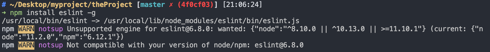
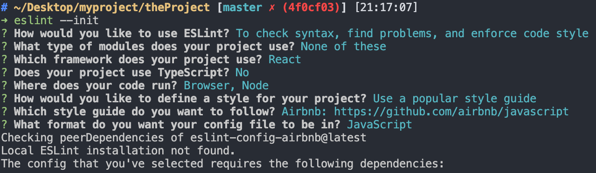
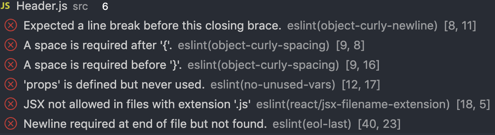

# ESLint 安裝與使用

ESLint 是一個 code 的檢查工具，他可以幫我們檢查我們 code 是否符合我們所設定的規範，並指出在哪裡。而 code 有著一定的規範，可以讓我們在團隊開發中，有著統一的標準，讓整個團隊開發更一致；對於個人則是可以讓我們學習許多資深開發者的想法，有助於個人程式碼攥寫的提升。

---

## ESLint 安裝

自己較常是全域安裝

```
npm install eslint -g
```

要注意 ESLint 對於 node 和 npm 版本有要求，如果不符合 ESLint 所要求的版本，請將 node 和 npm 安裝到目前的穩定版本。

一般我會使用

```
npm install npm -g
```

將 npm 重新安裝
再透過

```
npm install n -g
```

安裝 n 模組
這個 n 模組其實就是 node 的版本管理工具

可參考[官方介紹](https://docs.npmjs.com/downloading-and-installing-node-js-and-npm#osx-or-linux-node-version-managers)&[n 模組](https://github.com/tj/n)

在中國的 SegmentFault 也看到一篇不錯的說明，有興趣的可以[參考](https://segmentfault.com/a/1190000016956077)

<b><i>請注意上述 node 版本更新不適用 windows 上，windows 上請直接下載最新版的 node 並進行覆蓋，或參考官方說明文件，如何在 windows 上安裝多版本 node</i></b>

---

## ESLint 建置

在專案中，使用

```
eslint --init
```

建置.eslintrc.js 文件

建置過程中會問一些設定的問題，根據選項去選擇即可。至於 style guide 部分，有三種規範可以使用。分別是

- Google
- Airbnb
- Standard

其中 Airbnb 規範最嚴謹，Google 次之，個人是選擇 Airbnb。關於 Airbnb 的規範，可參考
此[連結](https://github.com/airbnb/javascript)。目前已經有繁體中文版，上方連結可找到。

在選擇完規範後，會選擇要以 yaml、js 還是 json 儲存規範，這邊選擇 js。

重開安裝 eslint 的專案，在問題部分就會提醒你 code 哪邊不符合規範。

比如說括號前後要空格，或是 props 參數沒用到等等。

在.eslintrc.js 的文件中，會有許多的設定。

- parser 是解析器，可以根據專案設定不同。
- extends 可以設定一些設定好的規範，如前面提到的 Airbnb 規範，就是寫在 extends 裡。
- rules 是指額外的規則，像上方圖片裡面有一條提到 js 文件裡面不能寫 JSX，這個問題我們即可在 reles 加入`"react/jsx-filename-extension": [1, { "extensions": [".js", ".jsx"] }],`來解決。
- ecmaFeatures 是設定可以使用哪些額外功能，像可以使用 JSX 等等。
- plugins 使用一些額外的第三方套件。
- env 環境，個人主要在 browser 和 node 上。
  關於 eslint 文件設定方法和參數設定，可參考[連結](https://eslint.org/docs/user-guide/configuring)。
