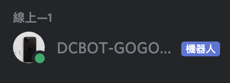

# Discord Bot

要製作 Discord Bot 目前主要有兩個 API 可以使用。

- discord.io (官方維護)
- discord.js (民間版本)

但從 npm 上可以發現目前 discord.io 已經約兩年沒有更新了，如果遇到任何 Bug，要等到官方修復可能需要一定的時間。也因此較推薦使用 discord.js 這個非官方的套件。

---

## 製作方法

- 先去 discord 官方建立一個 bot（可參考 discord.js 上的[教學](https://discordjs.guide/preparations/setting-up-a-bot-application.html#creating-your-bot))
- 把 bot 加入你所要放置的頻道
- 開始撰寫你的 bot

```JavaScript
// 讀取discord.js套件
const Discord = require('discord.js');

// 建立一個Discord client
const bot = new Discord.Client();

// 當你要啟動這個bot時，會執行的事情
bot.on('ready', () => {
  console.log('Ready!');
});

// 在建立一個bot時會取得token，這邊要輸入token
bot.login('your-token');
```

上述輸入完後，就會在你的 Discord 頻道看到 Discord 機器人。

我這邊因為已經啟動上述的 code，所以 bot 會是線上的狀況，如果沒有執行的話，會顯示離線。

在建立完 bot 之後，接下來就是要開始監聽輸入的內容。

```JavaScript
// message裡面會有使用者輸入的內容和使用者資料等等
bot.on('message', message => {
  console.log(message.content);
});
```

我們只需要去監聽使用者輸入的內容做相對應得事情。
例如使用!作為 bot 要回覆得行為偵測，
接下來就可以使用 switch...case 的寫法，來判定!後面的內容
如果!後面的內容並不是定義好的
可以再使用 default 來回覆錯誤訊息。
