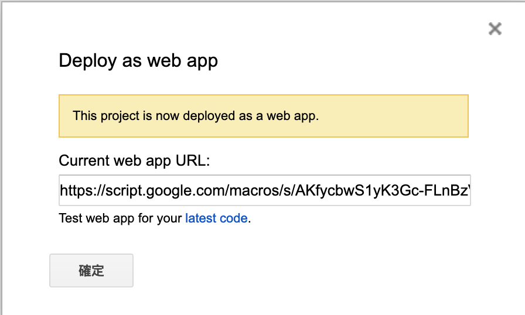

# Google Apps Script

Google Apps Script(GAS)是什麼，可以參考[wiki](https://en.wikipedia.org/wiki/Google_Apps_Script)的介紹。但我一般會把它解釋成一個後端，類似 nodejs 之類的。

在 GAS 裡面，你可以透過 JavaScript 去連接 Google 的各類服務，或是去連接 Google 的 Firebase 資料庫也是可以的。這邊我們會使用 GAS 來串接 Google Sheets。

## GAS 連結 Google 表單

要開啟 GAS 的編輯器，可以從 Google 表單上方的工具列 `工具>指令碼編輯器` 或是在 `Google 雲端硬碟右鍵>更多>Google Apps Script（要先連結 GAS 應用程式）`，開啟後副檔名應該會是 gs。

目前的 GAS 是可以使用 es6 語法的，但因為要做一些對應的設定，這邊我們會使用較舊的 JavaScript 語法撰寫。

```JavaScript
function doPost(e) {
  //取得參數
  var params = JSON.parse(e.postData.contents);
  var num = params.num;
  var one = params.one;
  var one_other = params.one_other;
  var boss_one = params.boss_one;
  var to = params.name;
  var date = params.date;

  //sheet資訊
  var SpreadSheet = SpreadsheetApp.openById("");
  var Sheet = SpreadSheet.getSheets()[0];


  //setValue...
  ...

  return ContentService.createTextOutput(params);
}
```

上述我們撰寫了一個 doPost 的 function。
doPost 其實就是我們在 Call 這隻 gs 檔的 API，進行 post 時會觸發的 function。

我們可以先透過 e 這個參數取得 post 的資料。
接下來透過`SpreadsheetApp.openById("")`選擇要開啟哪個 Google 表單的檔案，再透過`SpreadSheet.getSheets()[0]`綁定好選擇的檔案裡面的哪張表(0 表示第一張表)。

選擇好表後，就可以透過 getRange()取得表的指定格子位置，並透過 setValue()或 setFormula()方法來將值存入。

最後的 return 則是要回傳什麼內容。

## GAS 部署

在寫完 GAS 的 code 後，我們要部署並產生 API。
選擇`發佈>部署爲網路應用程式`，將具有應用程式存取權的使用者改爲 “Anyone, even anonymous“ ，並點選部署。

接下來第一次部署會出現權限核對的一些設定。
基本上就是`核對權限>選擇自己的帳戶>進階>前往>允許`。
點選完畢後會出現下圖


那串 URL 就是你的 API 路徑。

---

## 補充

- 在 GAS 內沒有 console.log()，要使用 Logger.log()

- GAS 的 goGet()和 doPost()方法，不能直接 return 一個 object。但可以轉成 JSON 回傳，詳細可[參考](https://developers.google.com/apps-script/guides/content)。
