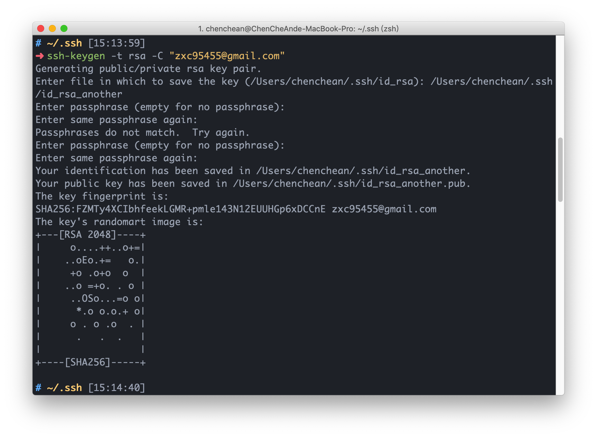

# 多 Github 帳號設定

透過 Hostname 來決定使用哪一組帳號的 SSH Key 進行溝通。

## SSH 生成

首先我們先使用`ssh-keygen`指令生成金鑰


圖中我們的指令為`ssh-keygen -t rsa -C "email@gamil.com"`

- -t 為加密方法的選擇，我們選擇使用 RSA 加密
- -C 為註解，會加入 SSH 的金鑰。可做為金鑰持有者的辨識。

輸入上述指令後，會分別詢問

- 金鑰存放位置和檔案名稱
- 是否設置 Passphrase（如有輸入，會須重複輸入一次）

上述均輸入完畢後，會產生 id_rsa 和 id_rsa.pub（這邊以預設檔名說明）

- id_rsa 此為私鑰，也就是要自己保管好的密碼。
- id_rsa.pub 此為公鑰，也就是對外公開的鑰匙，此會作為與本地端私鑰溝通使用。

---

## 將生成的金鑰複製到 Github

如果使用 linux，可以直接使用 ssh-copy-id 複製。

mac 如要使用 ssh-copy-id，需使用 Homebrew 安裝。

- mac 還可以使用 pbcopy 來複製，指令`pbcopy < ~/.ssh/id_rsa.pub`。

或是去打開檔案複製都可以。

---

## 設定 ssh config 方便選擇對應的 git 倉庫

在金鑰該層目錄，新增一 config 檔案。

可以使用`nano`或`vim`之類編輯都可以，看個人習慣。

`nano ~/.ssh/config`

新增下列資訊

```
Host github.com
    HostName github.com
    User git
    IdentityFile ~/.ssh/id_rsa

Host github-another
    HostName github.com
    User git
    IdentityFile ~/.ssh/id_rsa_new
```

- Host 後面的 github.com 或 github-another 就是你要連接倉庫的簡稱。
- HostName 填 HostNmae 的 domain 或 IP，因為是連 github，所以是 github.com。
- User 登入 SSH 的 username，個人習慣統一為 git。
- IdentityFile key 的路徑。
  其他還有 Port 或 ForwardX11 等指令。不過我們是連 github，所以不需要。

設定完成後
可以下`ssh -T <Host>`檢查。
ex: `ssh -T github-another`。

---

## Clone 與 push

- Clone: `git clone <host-in-ssh-config>:<username>/<repo>`
- Push: `git remote set-url origin <host-in-ssh-config>:<username>/<repo>`

---

## 補充

以往只有單一一組的 github，我們會直接在 git 的 global 設定好 username 和 email。

但在有多組的 github 帳號後，如不想均使用相通的名稱。
需先使用`git config — global — unset user.name `和`git config — global — unset user.email`取消 global 設定。

再根據 Repo 來決定 User 資料

- `git config user.name "userName"`
- `git config user.email "eamil"`
